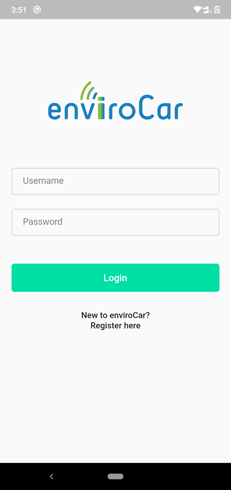
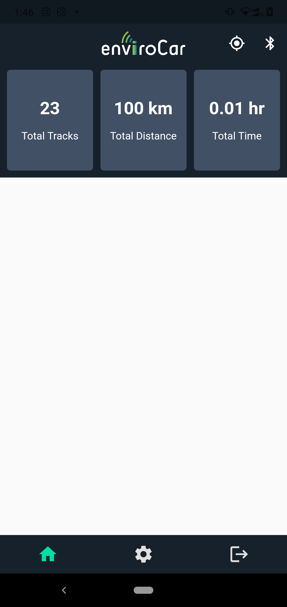
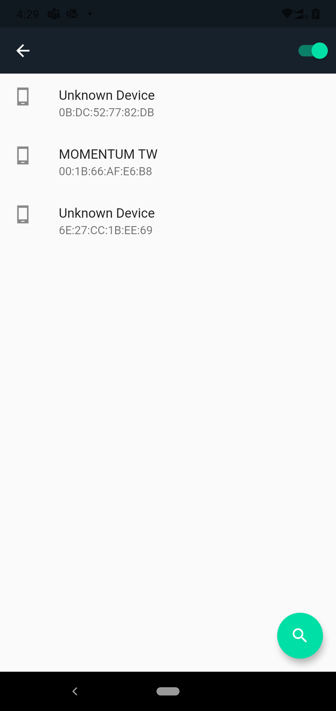

# enviroCar Cross-Platform App

## Introduction
This project contains code for a platform independent app that connects to enviroCar server and authenticates the user.
It is still under progress and will be developed further this summer.

<br>

## Design and Demo


|Login Screen|Home Screen|Bluetooth Screen|
|---------------------------------------------------------|------------------------------------------------------------|--------------------------------------------------------|
|  |  |  | 

<br>

## Key Features (More to be added soon)
1. Login with enviroCar username and password
2. Sign up with username, email and password
3. Turn Bluetooth On and Off from within the app
4. See a list of all the active Bluetooth Devices around

<br>

## How To Use

To clone and run this application, you'll need [Git](https://git-scm.com) and [Flutter](https://flutter.dev/docs/get-started/install) installed on your computer. From your command line:

```bash
# Clone this repository
$ git clone https://github.com/D-Ajay-Kumar/enviroCar-Cross-Platform-App.git

# Go into the repository

# Install dependencies
$ flutter packages get

# Run the app
$ flutter run
```
