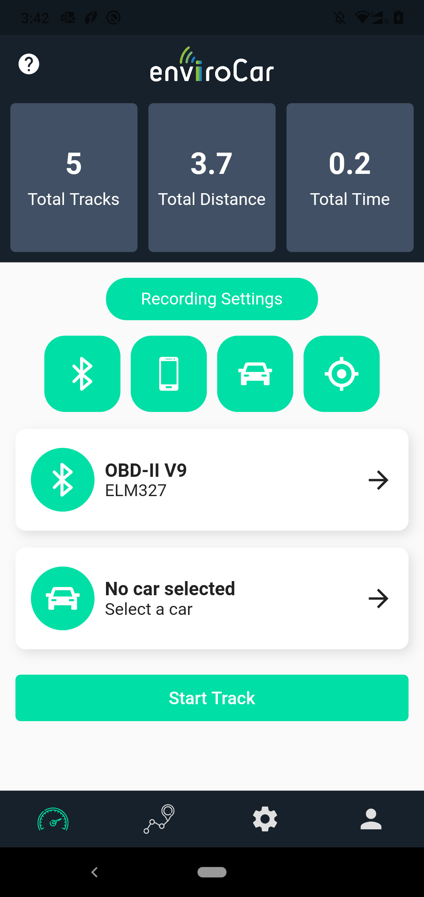
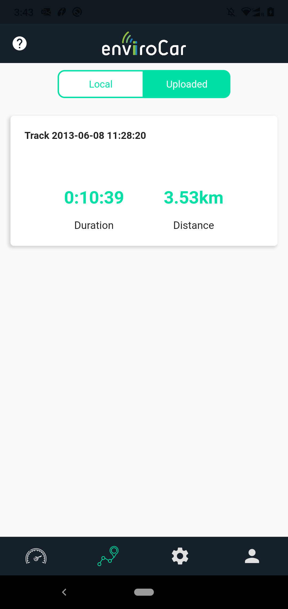
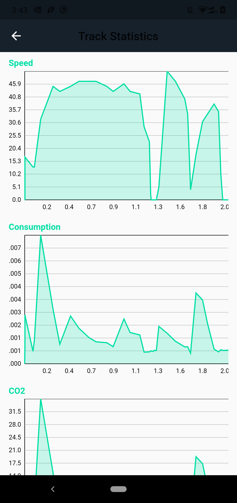
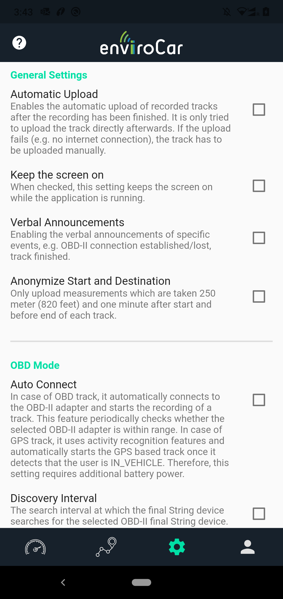
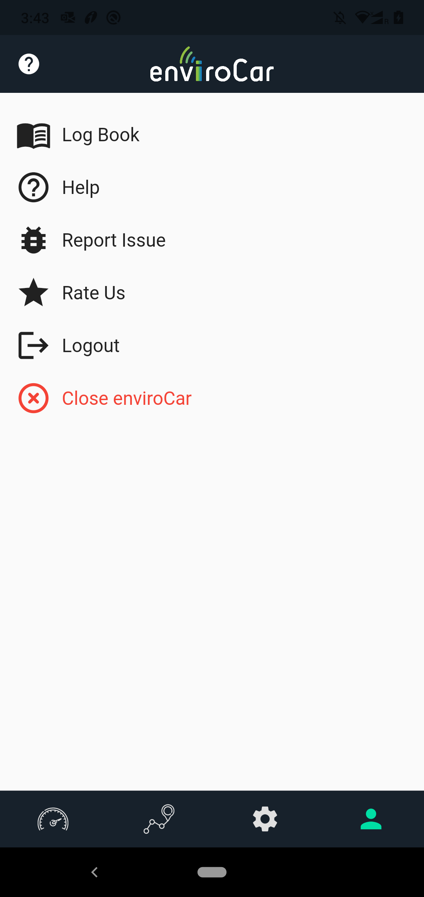
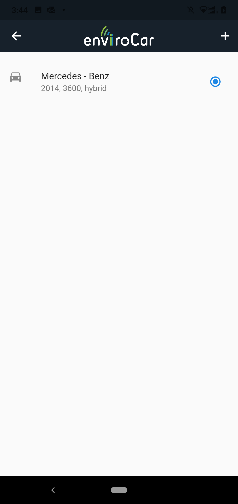

# enviroCar Cross-Platform App

## Introduction
enviroCar is a citizen science community that collects, shares, and analyzes floating car data for traffic management and the environment. It analyzes the open data and estimates the track count, average speed, relative speed, CO2 emission, fuel consumption, and hotspot analysis.

enviroCar is an android application that provides features like:

- Record tracks, explore recorded tracks, and upload tracks as open data for analysis.
- Sharing data i.e. uploading data as open data for analysis that estimates use it to estimateCO2emission, track count, average speed, relative speed, hotspot analysis.
- Provides real-time data about the track, the distance covered, and duration.

The project aims to build a cross-platform application so that the enviroCar app is available to iOS users as well since only two-thirds of people can use the application as of now.

<br>

## How To Use

To clone and run this application, you'll need [Git](https://git-scm.com) and [Flutter](https://flutter.dev/docs/get-started/install) installed on your computer. From your command line:

```bash
# Clone this repository
$ git clone https://github.com/enviroCar/enviroCar-Cross-Platform-App.git

# Go into the repository
$ cd enviroCar-Cross-Platform-App

# Install dependencies
$ flutter pub get

# Run the app
$ flutter run
```

<br>

## Key Technologies
- Dart
- Flutter SDK
- Provider State Management

<br>

## Key Features
1. Login and Signup with enviroCar credentials
2. Create and store cars in local DB
3. Create and store fueling logs in local DB and enviroCar server
4. Switch between Dark and Light themes
5. See your uploaded tracks and analyze their data graphically

<br>

## API Reference
See [envirocar.github.io/enviroCar-server](http://envirocar.github.io/enviroCar-server/api/).

The documentation is a GitHub page and managed in the branch gh-pages, see<br>
https://github.com/enviroCar/enviroCar-server/tree/gh-pages.

<br>

|Data Flow Diagram|
|---------------------------------------------------------|
|  |
[Link to the diagram](https://lucid.app/lucidchart/invitations/accept/inv_b7afa735-36b5-43e2-86aa-b5664bb3dabc?viewport_loc=-2185%2C-188%2C4369%2C2123%2C0_0)


<br>

|Data Management Diagram|
|---------------------------------------------------------|
|  |
[Link to the diagram](https://lucid.app/lucidchart/invitations/accept/inv_f46df426-7800-4ff0-9d31-38987ed10ca4?viewport_loc=439%2C-78%2C1707%2C753%2C0_0)


<br>

|Folder Structure|
|---------------------------------------------------------|
|  |
[Link to the diagram](https://lucid.app/lucidchart/invitations/accept/inv_26473ee7-bbd4-4fde-a30f-66341f7f3c5c?viewport_loc=-44%2C-128%2C1920%2C847%2C0_0)

<br>

<!-- ## Design and Demo
|Login and Register Screens|Dashboard, Tracks, Map and Bluetooth|
|---------------------------------------------------------|------------------------------------------------------------|
 |  -->

|Dashboard Screen|Tracks Screen|Track Details Screen|
|---------------------------------------------------------|------------------------------------------------------------|--------------------------------------------------------|
|  |  |  | 

|Graphs Screen|Settings Screen|Profile Screen
|---------------------------------------------------------|------------------------------------------------------------|--------------------------------------------------------|
|  |  |  | 

|Log Book Screen|Create Log Screen|Report Issue Screen
|---------------------------------------------------------|------------------------------------------------------------|--------------------------------------------------------|
|  |  |  | 


|Car Screen|Create Car Screen|Help Screen
|---------------------------------------------------------|------------------------------------------------------------|--------------------------------------------------------|
|  |  |  | 


