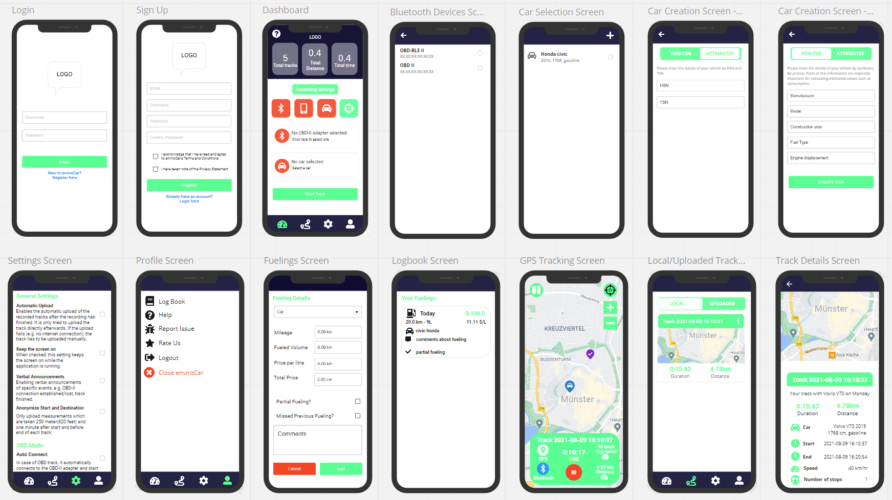

# Mockup

<br>

## Authentication
<p align = "center">
  <br>
</p>
<br>

## Dashboard Screen
The dashboard screen displays the user statistics i.e. the number of tracks uploaded by the user to the server, total distance covered during those tracks and total time taken by the tracks.
For recording the track, the following conditions need to be satisfied.
- ```The device should be connected to the OBD-II via Bluetooth.```
- ```A car should be selected.```
- ```Location services should be enabled.```

The color of the widgets indicates the status of required and necessary conditions to start recording. The first ```Bluetooth``` card indicates the status of ```device's Bluetooth```.
The second ```OBD-II``` card, indicates the whether the ```device is connected to OBD-II```. The third ```Car``` car indicates whether ```a car is selected```. The final ```Location```
card indicates the status of ```device's location services```.

When all the necessary and required conditions for recording a track are satisfied, user can record their track. 
<p align = "center">
  <br>
</p>
<br>

## Bluetooth Devices Screen
The bluetooth devices screen displays the nearby ```BLE devices```, the user can select the ```OBD-II``` device, establish a connection with it. Based upon the connection status, a toast
message is displayed whether the connection is successful.
<p align = "center">
  <br>
</p>
<br>

## Car Selection Screen
On the car selection screen, the ```user can select a car```, or can create a new car by tapping on the ```plus``` icon.
<p align = "center">
  <br>
</p>
<br>

## Car Creation Screen
User can create a car by adding the details of ```HSN or TSN of vehicle``` or by adding details of car by ```attributes```.
<p align = "center">
  
  <br>
</p>
<br>

## Settings Screen
The settings screen displays ```General settings```, ```OBD mode settings```, and lets the user to change the ```theme of the app```. 
<p align = "center">
  <br>
</p>
<br>

## Profile Screen
The profile screen displays option like ```logbook```, ```help```, ```report issue```, ```rate us```, ```logout``` and ```close enviroCar```. 
<p align = "center">
  <br>
</p>
<br>

## Fuelings Screen
The fuelings screen lets the user to add the details about the ```fueling``` of their car.
<p align = "center">
  <br>
</p>
<br>

## Logbook Screen
The logbook screen helps the user to manage their vehicle's ```fueling details``` by keeping a record of the fuelings.
<p align = "center">
  <br>
</p>
<br>

## GPS Tracking Screen
The GPS tracking screen lets the user ```record their track```. The upper right corner widgets allows the user to ```zoom in, zoom out or recenter their location on the map```. The ```pause``` 
button lets the user to ```pause GPS tracking``` and ```resume``` it. The details card displays the ```connection with OBD-II```, ```status of device's location services```, etc.
User can ```stop the recording``` by clicking on the ```stop track button```, then the user can save their track locally and can also set a ```custom name for the track```. 
<p align = "center">
  <br>
</p>
<br>

## Tracks Screen
The track screen displays the ```local``` and ```uploaded``` tracks. The user can ```view details of the track```, ```delete```, ```upload track as open data```, ```export track data``` for local tracks.
And user can ```view details of the track```, ```export track details``` for uploaded tracks.
<p align = "center">
  <br>
</p>
<br>

## Track Details Screen
The track details screen displays the ```map with pointers on start and destination location``` and ```details about the track```. 
<p align = "center">
  <br>
</p>
<br>
